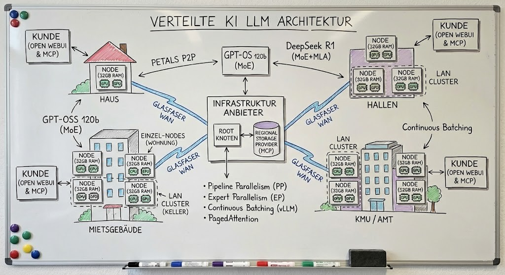
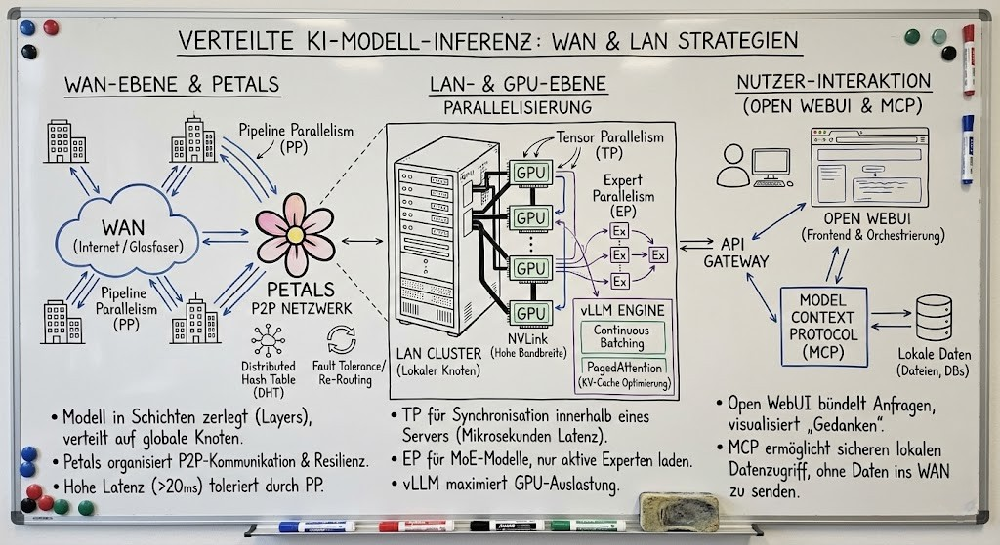

# Digitale Souveränität durch Verteilung

> ## TL;DR
>
> Traditionelle KI-Anbieter wie OpenAI, Google oder Microsoft setzen auf "Hyperscaling": Gigantische, zentralisierte Rechenzentren, die Milliarden kosten und Nutzer in eine technologische Abhängigkeit (**Vendor Lock-in**) zwingen. Im Gegensatz dazu ermöglicht die **horizontale Skalierung** die Nutzung vieler kleinerer Rechenknoten (**Nodes**), die über das Land verteilt sind. Anstatt ein Modell auf einem einzigen Supercomputer auszuführen, wird es in Fragmente zerlegt und auf vorhandene Hardware-Ressourcen verteilt. Durch den Einsatz von Open-Source-Software (OSS) behalten Organisationen die volle Kontrolle über ihre Daten und Algorithmen, ohne auf die Leistungsfähigkeit modernster Modelle verzichten zu müssen.

## Technische Machbarkeit und Infrastruktur

Für Informatiker stellt die Inferenz von Modellen wie **GPT-OSS 120b** oder **DeepSeek R1** über Weitverkehrsnetze (WAN) eine Herausforderung an die Physik der Datenübertragung dar.

### 1. Parallelisierungsstrategien für Glasfaser-Netze

Die Verteilung über Standorte hinweg wird primär durch die Latenz limitiert (20–100 ms im WAN).

- **Pipeline Parallelism (PP):**
  Das Modell wird horizontal in Schichten (Layers) zerlegt. Dies ist die primäre Methode für geografisch entfernte Knoten, da sie höhere Latenzen toleriert.
- **Expert Parallelism (EP):**
  Speziell für **Mixture-of-Experts (MoE)** Modelle wie DeepSeek R1 und GPT-OSS 120b. Da pro Rechenschritt nur ein Bruchteil der Parameter (z. B. 5,1 Mrd. von 120 Mrd. bei GPT-OSS) aktiv ist, sinkt die zu übertragende Datenmenge drastisch.
- **Tensor Parallelism (TP):**
  Ist aufgrund der notwendigen Synchronisation nach jeder Operation strikt auf die Kommunikation innerhalb eines Servers (NVLink) beschränkt.

### 2. Konkrete Infrastruktur-Lösung: Petals

Für ein landesweites Netzwerk ist **Petals** die empfohlene OSS-Lösung:

- **P2P-Architektur:**
  Funktioniert ähnlich wie BitTorrent; das Modell wird in Blöcke zerlegt und auf die Teilnehmer verteilt.
- **Resilienz:**
  Ein integriertes Routing-System (Distributed Hash Table) erkennt langsame oder ausgefallene Knoten und leitet Anfragen automatisch an redundante Kopien im Netzwerk weiter.
- **Leistung:**
  Erreicht selbst über das Internet nutzbare Geschwindigkeiten von ca. 5–10 Token/Sekunde bei großen Modellen.

### 3. Modell-Spezifikationen im Vergleich

| Merkmal            | GPT-OSS 120b                         | DeepSeek R1                                |
| :----------------- | :----------------------------------- | :----------------------------------------- |
| **Architektur**    | MoE (128 Experten)                   | MoE + MLA                                  |
| **VRAM (4-Bit)**   | ~80 GB (MXFP4 nativ)                 | ~350–400 GB                                |
| **Verteilbarkeit** | Exzellent durch hohe Experten-Dichte | Erfordert Replikation der "Shared Experts" |

### 4. Skalierung für mehrere Nutzer

Um eine hohe Anzahl gleichzeitiger Nutzer auf einem verteilten Modell zu bedienen, müssen die Inferenz-Backends spezifische Optimierungen nutzen:

- **Continuous Batching:**
  Engines wie **vLLM** erlauben es, neue Nutzeranfragen sofort in laufende Berechnungen einzuschieben, anstatt auf den Abschluss eines kompletten Durchlaufs zu warten.
- **PagedAttention:**
  Optimiert das Speichermanagement des Key-Value-Caches, was die Kapazität für gleichzeitige Nutzeranfragen im VRAM massiv erhöht.
- **API-Abstraktion:**
  **Open WebUI** kann als zentraler Orchestrator dienen, der Anfragen bündelt und an das verteilte Backend (Petals oder vLLM-Cluster) über eine OpenAI-kompatible Schnittstelle weitergibt.

### 5. Nutzeranwendung: Open WebUI und MCP

Die Integration erfolgt über einen modernen Frontend-Stack:

- **Open WebUI:**
  Dient als Docker-basiertes Interface, das die technische Komplexität kapselt und native Visualisierungen für die Denkprozesse von Modellen wie DeepSeek R1 bietet.
- **Model Context Protocol (MCP):**
  Da das "Gehirn" (Modell) weit entfernt läuft, ermöglicht MCP die sichere Einbindung lokaler Datenquellen (Dateien, Datenbanken). Das Modell generiert einen Funktionsaufruf, der lokal durch Open WebUI ausgeführt wird, wodurch sensible Daten den Standort nicht verlassen müssen.
