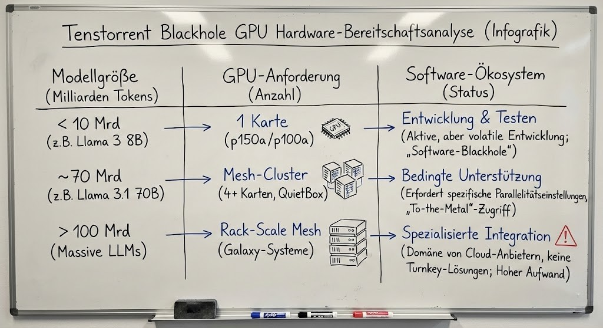

# **Analyse der Tenstorrent Blackhole-Architektur**

**Technischer Statusbericht 2025–2026**

Diese Seite beschäftigt sich mit der p150a RISC-V-Infrastruktur von Tenstorrent. Der Fokus liegt auf der Hardware-Effizienz, der Skalierbarkeit durch Standardprotokolle und dem aktuellen Integrationsstand in bestehende Software-Ökosysteme.

## **Architektur und Skalierbarkeit**

Die Blackhole-Architektur adressiert gängige Datendurchsatz-Engpässe im Bereich KI-Inferenz durch den Einsatz von Standard-Netzwerkprotokollen und frei programmierbaren Rechenkernen.

### **Technische Merkmale**

- **Tensix-Core-Grid (140 Kerne)**
  Programmierbare RISC-V-Kerne, implementiert in einem Network-on-Chip (NoC). Dieser Ansatz bietet eine höhere Flexibilität bei der Kernel-Entwicklung im Vergleich zu spezialisierten Festfunktions-ASICs.
- **Speicherinterface (GDDR6, 512 GB/s)**
  Einsatz von Standard-GDDR6-Modulen zur Optimierung der Stückkosten (BOM) bei gleichzeitiger Bereitstellung der für rechenintensive Inferenz-Workloads erforderlichen Bandbreite.
- **Ethernet-Konnektivität (800G Mesh)**
  Native Ethernet-Schnittstellen ermöglichen den Aufbau von Clustern ohne dedizierte Switches (Direct-Attach), was eine nahezu lineare Skalierung der Rechenleistung unterstützt.

## **Felddaten und Evaluierung**

Zusammenfassung technischer Rückmeldungen aus Laborumgebungen und von frühen Entwicklungspartnern.

**Technisches Review (Interimsbericht)**

> „Die Latenzzeit für das erste Token ist gering. Der Software-Stack befindet sich jedoch noch in einem frühen Stadium; bei hoher Telemetrie-Last treten Instabilitäten auf Treiberebene auf.“  
> — Pro Hi-Tech Labs

**Infrastruktur-Analyse (Betriebswerte)**

> „Die Leistungsaufnahme im Leerlauf beträgt ca. 120 W pro Karte. Dies führt zu einer suboptimalen Energieeffizienz in Szenarien, in denen das System auf neue Rechenaufgaben warten muss.“  
> — SME Cluster Insights

## **Kennzahlen zur Einsatzreife**

| Metrik                         | Status  | Analyse                                                                                   |
| :----------------------------- | :------ | :---------------------------------------------------------------------------------------- |
| **Hardware-Stabilität**        | Hoch    | Die Silizium-Fertigung ist abgeschlossen; die Hardware arbeitet spezifikationsgemäß.      |
| **Software-Reifegrad**         | Niedrig | Die aktive Entwicklung der Treiber führt derzeit noch zu wöchentlichen API-Änderungen.    |
| **Ökosystem (Metalium)**       | Mittel  | TT-Metalium bietet weitreichende Kontrolle, erfordert jedoch eine intensive Einarbeitung. |
| **Preis-Leistungs-Verhältnis** | Hoch    | Sehr kompetitive Kosten pro Rechenoperation ($\\$/\\text{FLOP}$) auf Hardware-Ebene.      |

### **Zusammenfassende Bewertung**

- **Produktivumgebungen:** **NICHT EMPFOHLEN**
  Aufgrund der aktuellen Treiber-Instabilitäten ist ein hoher personeller Aufwand für die Plattformwartung erforderlich.
- **Forschung und Entwicklung:** **GEEIGNET**
  Bietet eine solide Grundlage für die Implementierung kundenspezifischer Kernel und akademische Forschung im Bereich neuartiger KI-Beschleuniger.

## **Kostenanalyse (TCO)**

**10-Jahres-Prognose der Gesamtbetriebskosten für 128 GB Cluster-Kapazität**

| Hardware-Konfiguration      | Geschätzte Kosten | Marktsegment              |
| :-------------------------- | :---------------- | :------------------------ |
| Tenstorrent p150a (4 Units) | 5.600$            | Kostenoptimierte Hardware |
| NVIDIA RTX 5090 (4 Units)   | ~8.800$           | Prosumer-Segment          |
| NVIDIA H100 (2 Units)       | 50.000+$          | Enterprise-Standard       |

## **Zielgruppenanalyse**

- **🔬 Forschungseinrichtungen:**
  Geeignet für die Entwicklung nativer Compute Kernel und die Evaluation neuartiger Modellarchitekturen unter Verwendung aktueller Toolchains.
- **🎓 Akademische Lehre:**
  Aufgrund der geringen Hardware-Anschaffungskosten pro Recheneinheit prädestiniert für Kurse zu paralleler Programmierung und ML-Hardware-Design.
- **⚠️ Enterprise-Sektor:**
  Die produktive Einführung setzt eine stabile API-Version (LTS) und eine verlässliche Telemetrie-Einbindung voraus.

_Erstellt auf Basis von Marktdaten und technischen Analysen, Stand Januar 2026_
